##  Spark RDDs Vs DataFrames vs SparkSQL - Part 3 : Web Server Log Analysis

This is the third tutorial on the Spark RDDs Vs DataFrames vs SparkSQL blog post series. The first one is available [here](http://datascience-enthusiast.com/Python/DataFramesVsRDDsSpark-Part1.html). In the first part, we saw how to retrieve, sort and filter data using Spark RDDs, DataFrames and SparkSQL. In the second part [(here)](http://datascience-enthusiast.com/Python/DataFramesVsRDDsVsSQLSpark-Part2.html), we saw how to work with multiple tables in Spark the RDD way, the DataFrame way and with SparkSQL. In this third part of the blog post series, we will perform web server log analysis using real-world text-based production logs. Log data can be used monitoring servers, improving business and customer intelligence, building recommendation systems, fraud detection, and much more. Server log analysis is a good use case for Spark. It's a very large, common data source and contains a rich set of information. 

If you like this tutorial series, check also my other recent blos posts on Spark on [Analyzing the Bible and the Quran using Spark](http://datascience-enthusiast.com/Python/analyzing_bible_quran_with_spark.html) and [Spark DataFrames: Exploring Chicago Crimes](http://datascience-enthusiast.com/Python/SparkDataFrames-ExploringChicagoCrimes.html). The data and the notebooks can be downloaded from my [GitHub repository](https://github.com/fissehab/Spark_certification). 


The log files that we use for this assignment are in the [Apache Common Log Format (CLF)](http://httpd.apache.org/docs/1.3/logs.html#common). The log file entries produced in CLF will look something like this:

**127.0.0.1 - - [01/Aug/1995:00:00:01 -0400] "GET /images/launch-logo.gif HTTP/1.0" 200 1839**
Each part of this log entry is described below.

**127.0.0.1** This is the IP address (or host name, if available) of the client (remote host) which made the request to the server.

**-**  The "hyphen" in the output indicates that the requested piece of information (user identity from remote machine) is not available.

**-** The "hyphen" in the output indicates that the requested piece of information (user identity from local logon) is not available.

**[01/Aug/1995:00:00:01 -0400]** the time that the server finished processing the request. The format is: [day/month/year:hour:minute:second timezone]

        day = 2 digits
        month = 3 letters
        year = 4 digits
        hour = 2 digits
        minute = 2 digits
        second = 2 digits
        zone = (+ | -) 4 digits

**"GET /images/launch-logo.gif HTTP/1.0"** This is the first line of the request string from the client. It consists of a three components: the request method (e.g., GET, POST, etc.), the endpoint (a Uniform Resource Identifier), and the client protocol version.

**200** This is the status code that the server sends back to the client. This information is very valuable, because it reveals whether the request resulted in a successful response (codes beginning in 2), a redirection (codes beginning in 3), an error caused by the client (codes beginning in 4), or an error in the server (codes beginning in 5). 

**1839** The last entry indicates the size of the object returned to the client, not including the response headers. If no content was returned to the client, this value will be "-" (or sometimes 0).

we will use a data set from NASA Kennedy Space Center WWW server in Florida. The full data set is freely available [here](http://ita.ee.lbl.gov/html/contrib/NASA-HTTP.html) and contains two month's of all HTTP requests.

Let's download the data. Since I am using Jupyter Notebook, ! helps us to run a shell command


```python
! wget ftp://ita.ee.lbl.gov/traces/NASA_access_log_Jul95.gz
```

    --2017-12-23 09:37:49--  ftp://ita.ee.lbl.gov/traces/NASA_access_log_Jul95.gz
               => ‘NASA_access_log_Jul95.gz.1’
    Resolving ita.ee.lbl.gov (ita.ee.lbl.gov)... 131.243.2.164, 2620:83:8000:102::a4
    Connecting to ita.ee.lbl.gov (ita.ee.lbl.gov)|131.243.2.164|:21... connected.
    Logging in as anonymous ... Logged in!
    ==> SYST ... done.    ==> PWD ... done.
    ==> TYPE I ... done.  ==> CWD (1) /traces ... done.
    ==> SIZE NASA_access_log_Jul95.gz ... 20676672
    ==> PASV ... done.    ==> RETR NASA_access_log_Jul95.gz ... done.
    Length: 20676672 (20M) (unauthoritative)
    
    NASA_access_log_Jul 100%[===================>]  19.72M   604KB/s    in 39s     
    
    2017-12-23 09:38:29 (523 KB/s) - ‘NASA_access_log_Jul95.gz.1’ saved [20676672]
    


```python
! wget ftp://ita.ee.lbl.gov/traces/NASA_access_log_Aug95.gz
```

    --2017-12-23 09:38:29--  ftp://ita.ee.lbl.gov/traces/NASA_access_log_Aug95.gz
               => ‘NASA_access_log_Aug95.gz.1’
    Resolving ita.ee.lbl.gov (ita.ee.lbl.gov)... 131.243.2.164, 2620:83:8000:102::a4
    Connecting to ita.ee.lbl.gov (ita.ee.lbl.gov)|131.243.2.164|:21... connected.
    Logging in as anonymous ... Logged in!
    ==> SYST ... done.    ==> PWD ... done.
    ==> TYPE I ... done.  ==> CWD (1) /traces ... done.
    ==> SIZE NASA_access_log_Aug95.gz ... 16633316
    ==> PASV ... done.    ==> RETR NASA_access_log_Aug95.gz ... done.
    Length: 16633316 (16M) (unauthoritative)
    
    NASA_access_log_Aug 100%[===================>]  15.86M   620KB/s    in 29s     
    
    2017-12-23 09:38:59 (562 KB/s) - ‘NASA_access_log_Aug95.gz.1’ saved [16633316]
    


### Create Spark Context and SQL Context.


```python
from pyspark import SparkContext, SparkConf
from pyspark.sql import SQLContext


conf = SparkConf().setAppName("Spark-RDD-DataFrame_SQL").setMaster("local[*]")
sc = SparkContext.getOrCreate(conf)

sqlcontext = SQLContext(sc)
```

#### Create RDD


```python
rdd = sc.textFile("NASA_access*")
```

####  Show sample logs


```python
for line in rdd.sample(withReplacement = False, fraction = 0.000001, seed = 120).collect():
    print(line)
    print("\n")
```

    ix-esc-ca1-05.ix.netcom.com - - [29/Aug/1995:00:42:36 -0400] "GET /software/winvn/winvn.gif HTTP/1.0" 200 25218
    
    
    165.93.118.73 - - [29/Aug/1995:10:04:53 -0400] "GET /images/USA-logosmall.gif HTTP/1.0" 200 234
    
    
    dd16-043.compuserve.com - - [30/Aug/1995:22:28:41 -0400] "GET /images/ksclogo-medium.gif HTTP/1.0" 200 5866
    
    


#### Use regular expressions to extract the logs


```python
import re

def parse_log1(line):
    match = re.search('^(\S+) (\S+) (\S+) \[(\S+) [-](\d{4})\] "(\S+) (\S+) (\S+) (\d{3}) (\S+)', line)
    if match is None:
        return 0
    else:
        return 1
```


```python
n_logs = rdd.count()

failed = rdd.map(lambda line: parse_log1(line)).filter(lambda line: line == 0).count()

print('Out of {} logs, {} failed to parse'.format(n_logs,failed))
```

    Out of 3738455 logs, 285027 failed to parse


we see that 8185 out of the 3.5 million logs failed to parse. I took samples of the failed logs and tried to modify the above regular expression pattern as show below.


```python
def parse_log2(line):

    match = re.search('^(\S+) (\S+) (\S+) \[(\S+) [-](\d{4})\] "(\S+)\s*(\S+)\s*(\S+)\s*([/\w\.\s*]+)?\s*"* (\d{3}) (\S+)',line)
    if match is None:
        match = re.search('^(\S+) (\S+) (\S+) \[(\S+) [-](\d{4})\] "(\S+)\s*([/\w\.]+)>*([\w/\s\.]+)\s*(\S+)\s*(\d{3})\s*(\S+)',line)
    if match is None:
        return (line, 0)
    else:
        return (line, 1)
```


```python
failed = rdd.map(lambda line: parse_log2(line)).filter(lambda line: line[1] == 0).count()

print('Out of {} logs, {} failed to parse'.format(n_logs,failed))
```

    Out of 3738455 logs, 278095 failed to parse


Still, 1253 of them failed to parse. However, since we have successfully parsed more than 99.9% of the data, we can work with what we have parsed. You can play with the regular expression pattern to match all of the data :).

#### Extract the 11 elements from each log


```python
def map_log(line):

    match = re.search('^(\S+) (\S+) (\S+) \[(\S+) [-](\d{4})\] "(\S+)\s*(\S+)\s*(\S+)\s*([/\w\.\s*]+)?\s*"* (\d{3}) (\S+)',line)
    if match is None:
        match = re.search('^(\S+) (\S+) (\S+) \[(\S+) [-](\d{4})\] "(\S+)\s*([/\w\.]+)>*([\w/\s\.]+)\s*(\S+)\s*(\d{3})\s*(\S+)',line)
    
    return(match.groups())
```


```python
parsed_rdd = rdd.map(lambda line: parse_log2(line)).filter(lambda line: line[1] == 1).map(lambda line : line[0])
```


```python
parsed_rdd2 = parsed_rdd.map(lambda line: map_log(line))
```

#### Show 3 lines


```python
for i in parsed_rdd2.take(3):
    print(i)
    print('\n')
```

    ('199.72.81.55', '-', '-', '01/Jul/1995:00:00:01', '0400', 'GET', '/history/apollo/', 'HTTP/1.0"', None, '200', '6245')
    
    
    ('unicomp6.unicomp.net', '-', '-', '01/Jul/1995:00:00:06', '0400', 'GET', '/shuttle/countdown/', 'HTTP/1.0"', None, '200', '3985')
    
    
    ('199.120.110.21', '-', '-', '01/Jul/1995:00:00:09', '0400', 'GET', '/shuttle/missions/sts-73/mission-sts-73.html', 'HTTP/1.0"', None, '200', '4085')
    
    


As shown below, each line is a log of length 11.


```python
parsed_rdd2.map(lambda line: len(line)).distinct().collect()
```


    [11]


Now, let's try to answer some questions.

#### 1.  Find the 10 most common IP addresses (or host name, if available) of the client (remote host) which made the request to the server.

**RDD way**


```python
result = parsed_rdd2.map(lambda line: (line[0],1)).reduceByKey(lambda a, b: a + b).takeOrdered(10, lambda x: -x[1])
result
```


    [('piweba3y.prodigy.com', 21988),
     ('piweba4y.prodigy.com', 16437),
     ('piweba1y.prodigy.com', 12825),
     ('edams.ksc.nasa.gov', 11964),
     ('163.206.89.4', 9697),
     ('news.ti.com', 8161),
     ('www-d1.proxy.aol.com', 8047),
     ('alyssa.prodigy.com', 8037),
     ('siltb10.orl.mmc.com', 7573),
     ('www-a2.proxy.aol.com', 7516)]


We can also use Pandas and Matplotlib to creata a viz.


```python
import pandas as pd
import matplotlib.pyplot as plt
%matplotlib inline
```


```python
Host = [x[0] for x in result]
count = [x[1] for x in result]
Host_count_dct = {'Host':Host, 'count':count}
Host_count_df = pd.DataFrame(Host_count_dct )


myplot = Host_count_df.plot(figsize = (12,8), kind = "barh", color = "#7a7a52", width = 0.8,
                               x = "Host", y = "count", legend = False)

myplot.invert_yaxis()

plt.xlabel("Count", fontsize = 16)
plt.ylabel("Host", fontsize = 16)
plt.title("Most common hosts  ", fontsize = 20, color = 'b')
plt.xticks(size = 14)
plt.yticks(size = 14)
plt.show()
```


**DataFrame way**


```python
parsed_df = sqlcontext.createDataFrame(parsed_rdd2,
                                       schema = ['host','identity_remote', 'identity_local','date_time',
                                                 'time_zone','request_method','endpoint','client_protocol','mis',
                                                 'status_code','size_returned'], samplingRatio = 0.1)
```


```python
parsed_df.printSchema()
```

    root
     |-- host: string (nullable = true)
     |-- identity_remote: string (nullable = true)
     |-- identity_local: string (nullable = true)
     |-- date_time: string (nullable = true)
     |-- time_zone: string (nullable = true)
     |-- request_method: string (nullable = true)
     |-- endpoint: string (nullable = true)
     |-- client_protocol: string (nullable = true)
     |-- mis: string (nullable = true)
     |-- status_code: string (nullable = true)
     |-- size_returned: string (nullable = true)
    


```python
parsed_df.groupBy('host').count().orderBy('count', ascending = False).show(10, truncate = False)
```

    +--------------------+-----+
    |host                |count|
    +--------------------+-----+
    |piweba3y.prodigy.com|21988|
    |piweba4y.prodigy.com|16437|
    |piweba1y.prodigy.com|12825|
    |edams.ksc.nasa.gov  |11964|
    |163.206.89.4        |9697 |
    |news.ti.com         |8161 |
    |www-d1.proxy.aol.com|8047 |
    |alyssa.prodigy.com  |8037 |
    |siltb10.orl.mmc.com |7573 |
    |www-a2.proxy.aol.com|7516 |
    +--------------------+-----+
    only showing top 10 rows
    


** SQL way**


```python
parsed_df.createOrReplaceTempView("parsed_table")

sqlcontext.sql('SELECT host, count(*) AS count FROM parsed_table GROUP BY\
               host ORDER BY count DESC LIMIT 10 ').show()
```

    +--------------------+-----+
    |                host|count|
    +--------------------+-----+
    |piweba3y.prodigy.com|21988|
    |piweba4y.prodigy.com|16437|
    |piweba1y.prodigy.com|12825|
    |  edams.ksc.nasa.gov|11964|
    |        163.206.89.4| 9697|
    |         news.ti.com| 8161|
    |www-d1.proxy.aol.com| 8047|
    |  alyssa.prodigy.com| 8037|
    | siltb10.orl.mmc.com| 7573|
    |www-a2.proxy.aol.com| 7516|
    +--------------------+-----+
    


#### 2. Find statistics of the size of the object returned to the client.

**RDD way**


```python
def convert_long(x):
    x = re.sub('[^0-9]',"",x) 
    if x =="":
        return 0
    else:
        return int(x)
```


```python
parsed_rdd2.map(lambda line: convert_long(line[-1])).stats()
```


    (count: 3460360, mean: 18935.441238194595, stdev: 73043.8640344, max: 6823936.0, min: 0.0)


**DataFrame way**

Here, we can use functions from pyspark.


```python
from pyspark.sql.functions import mean, udf, col, min, max, stddev, count
from pyspark.sql.types import DoubleType, IntegerType
```


```python
my_udf = udf(convert_long, IntegerType() )
(parsed_df.select(my_udf('size_returned').alias('size'))
 .select(mean('size').alias('Mean Size'),
  max('size').alias('Max Size'),
  min('size').alias('Min Size'),
  count('size').alias('Count'),
  stddev('size').alias('stddev Size')).show()
)
```

    +-----------------+--------+--------+-------+-----------------+
    |        Mean Size|Max Size|Min Size|  Count|      stddev Size|
    +-----------------+--------+--------+-------+-----------------+
    |18935.44123819487| 6823936|       0|3460360|73043.87458874052|
    +-----------------+--------+--------+-------+-----------------+
    


**SQL way**


```python
parsed_df_cleaned = parsed_rdd2.map(lambda line: convert_long(line[-1])).toDF(IntegerType())
parsed_df_cleaned.createOrReplaceTempView("parsed_df_cleaned_table")
sqlcontext.sql("SELECT avg(value) AS Mean_size, max(value) AS Max_size, \
                min(value) AS Min_size, count(*) AS count, \
                std(value) AS stddev_size FROM parsed_df_cleaned_table").show()
```

    +-----------------+--------+--------+-------+-----------------+
    |        Mean_size|Max_size|Min_size|  count|      stddev_size|
    +-----------------+--------+--------+-------+-----------------+
    |18935.44123819487| 6823936|       0|3460360|73043.87458874052|
    +-----------------+--------+--------+-------+-----------------+
    


#### 3. Find the number of logs  with each response code.

**RDD way**


```python
n_codes = parsed_rdd2.map(lambda line: (line[-2], 1)).distinct().count()

codes_count = (parsed_rdd2.map(lambda line: (line[-2], 1))
          .reduceByKey(lambda a, b: a + b)
          .takeOrdered(n_codes, lambda x: -x[1]))
codes_count
```


    [('200', 3099280),
     ('304', 266773),
     ('302', 73070),
     ('404', 20890),
     ('403', 225),
     ('500', 65),
     ('501', 41),
     ('400', 14),
     ('243', 1),
     ('199', 1)]


```python
codes =[x[0] for x in codes_count]
count =[x[1] for x in codes_count]

codes_dict = {'code':codes,'count':count}
codes_df = pd.DataFrame(codes_dict)
plot = codes_df.plot(figsize = (12, 6), kind = 'barh', y = 'count', x = 'code', legend = False)
plot.invert_yaxis()
plt.title('Number of requests by response code', fontsize = 20, color = 'b')
plt.xlabel('Count', fontsize = 16, color = 'b')
plt.ylabel('Response code', fontsize = 16, color = 'b')
plt.xticks(size = 14)
plt.yticks(size = 14)
plt.show()
```


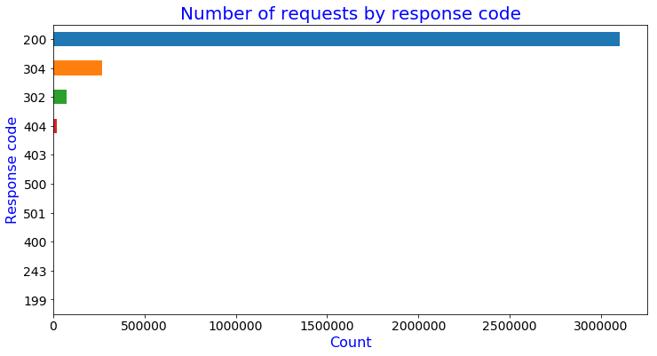


We can also create a pie chart as below.


```python
def pie_pct_format(value):
    return '' if value < 7 else '%.0f%%' % value

fig = plt.figure(figsize =(10, 10), facecolor = 'white', edgecolor = 'white')
colors = ['yellowgreen', 'lightskyblue', 'gold', 'purple', 'lightcoral', 'yellow', 'black']
explode = (0.05, 0.05, 0.1, 0, 0, 0, 0,0,0,0)
patches, texts, autotexts = plt.pie(count, labels = codes, colors = colors,
                                    explode = explode, autopct = pie_pct_format,
                                    shadow = False,  startangle = 125)
for text, autotext in zip(texts, autotexts):
    if autotext.get_text() == '':
        text.set_text('')  
plt.legend(codes, loc = (0.80, -0.1), shadow=True)
pass
```


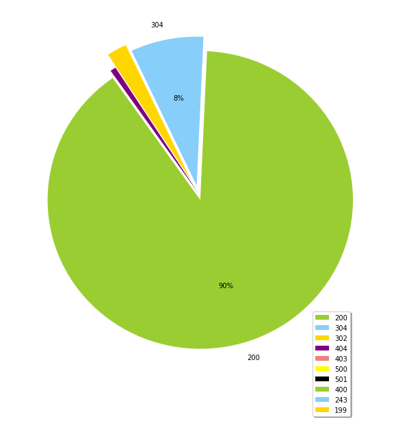


**DataFrame way**


```python
parsed_df.groupBy('status_code').count().orderBy('count', ascending = False).show()
```

    +-----------+-------+
    |status_code|  count|
    +-----------+-------+
    |        200|3099280|
    |        304| 266773|
    |        302|  73070|
    |        404|  20890|
    |        403|    225|
    |        500|     65|
    |        501|     41|
    |        400|     14|
    |        199|      1|
    |        243|      1|
    +-----------+-------+
    


**SQL way**


```python
sqlcontext.sql("SELECT status_code, count(*) AS count FROM parsed_table \
GROUP BY status_code ORDER BY count DESC").show()
```

    +-----------+-------+
    |status_code|  count|
    +-----------+-------+
    |        200|3099280|
    |        304| 266773|
    |        302|  73070|
    |        404|  20890|
    |        403|    225|
    |        500|     65|
    |        501|     41|
    |        400|     14|
    |        199|      1|
    |        243|      1|
    +-----------+-------+
    


#### 4. What are the top ten endpoints?

**RDD way**


```python
result = parsed_rdd2.map(lambda line: (line[6],1)).reduceByKey(lambda a, b: a + b).takeOrdered(10, lambda x: -x[1])
result
```


    [('/images/NASA-logosmall.gif', 208798),
     ('/images/KSC-logosmall.gif', 164976),
     ('/images/MOSAIC-logosmall.gif', 127916),
     ('/images/USA-logosmall.gif', 127082),
     ('/images/WORLD-logosmall.gif', 125933),
     ('/images/ksclogo-medium.gif', 121580),
     ('/ksc.html', 83918),
     ('/images/launch-logo.gif', 76009),
     ('/history/apollo/images/apollo-logo1.gif', 68898),
     ('/shuttle/countdown/', 64740)]


```python
endpoint = [x[0] for x in result]
count = [x[1] for x in result]
endpoint_count_dct = {'endpoint':endpoint, 'count':count}
endpoint_count_df = pd.DataFrame(endpoint_count_dct )


myplot = endpoint_count_df .plot(figsize = (12,8), kind = "barh", color = "#669999", width = 0.8,
                               x = "endpoint", y = "count", legend = False)

myplot.invert_yaxis()

plt.xlabel("Count", fontsize = 16)
plt.ylabel("End point", fontsize = 16)
plt.title("Top ten endpoints ", fontsize = 20, color = 'b')
plt.xticks(size = 14)
plt.yticks(size = 14)
plt.show()
```


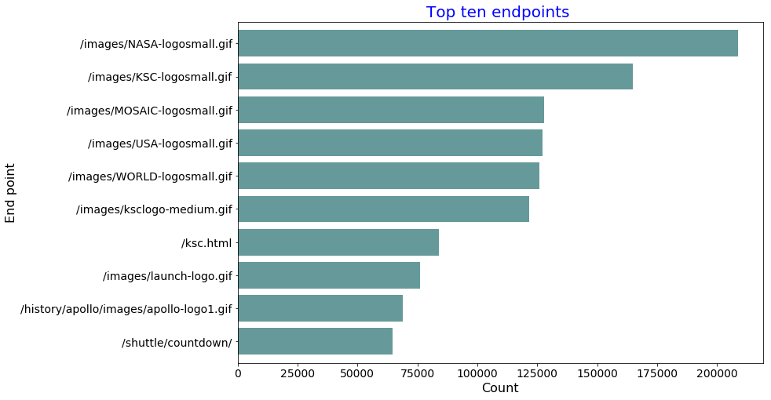


**DataFrame way**


```python
parsed_df.groupBy('endpoint').count().orderBy('count', ascending = False).show(10, truncate = False)
```

    +---------------------------------------+------+
    |endpoint                               |count |
    +---------------------------------------+------+
    |/images/NASA-logosmall.gif             |208798|
    |/images/KSC-logosmall.gif              |164976|
    |/images/MOSAIC-logosmall.gif           |127916|
    |/images/USA-logosmall.gif              |127082|
    |/images/WORLD-logosmall.gif            |125933|
    |/images/ksclogo-medium.gif             |121580|
    |/ksc.html                              |83918 |
    |/images/launch-logo.gif                |76009 |
    |/history/apollo/images/apollo-logo1.gif|68898 |
    |/shuttle/countdown/                    |64740 |
    +---------------------------------------+------+
    only showing top 10 rows
    


**SQL way**


```python
sqlcontext.sql("SELECT endpoint, count(*) AS count FROM parsed_table \
GROUP BY endpoint ORDER BY count DESC LIMIT 10").show(truncate = False)
```

    +---------------------------------------+------+
    |endpoint                               |count |
    +---------------------------------------+------+
    |/images/NASA-logosmall.gif             |208798|
    |/images/KSC-logosmall.gif              |164976|
    |/images/MOSAIC-logosmall.gif           |127916|
    |/images/USA-logosmall.gif              |127082|
    |/images/WORLD-logosmall.gif            |125933|
    |/images/ksclogo-medium.gif             |121580|
    |/ksc.html                              |83918 |
    |/images/launch-logo.gif                |76009 |
    |/history/apollo/images/apollo-logo1.gif|68898 |
    |/shuttle/countdown/                    |64740 |
    +---------------------------------------+------+
    


#### 5. What are the top eight endpoints which did not have return code 200? 
These are error endpoints

**RDD way**


```python
result = (parsed_rdd2.filter(lambda line: line[9] != '200')
          .map(lambda line: (line[6], 1))
          .reduceByKey(lambda a, b: a+b)
          .takeOrdered(8, lambda x: -x[1]))
result
```


    [('/images/NASA-logosmall.gif', 40090),
     ('/images/KSC-logosmall.gif', 23763),
     ('/images/MOSAIC-logosmall.gif', 15245),
     ('/images/USA-logosmall.gif', 15142),
     ('/images/WORLD-logosmall.gif', 14773),
     ('/images/ksclogo-medium.gif', 13559),
     ('/images/launch-logo.gif', 8806),
     ('/history/apollo/images/apollo-logo1.gif', 7489)]


```python
endpoint = [x[0] for x in result]
count = [x[1] for x in result]
endpoint_count_dct = {'endpoint':endpoint, 'count':count}
endpoint_count_df = pd.DataFrame(endpoint_count_dct )

myplot = endpoint_count_df .plot(figsize = (12,8), kind = "barh", color = "#ff4000", width = 0.8,
                               x = "endpoint", y = "count", legend = False)

myplot.invert_yaxis()

plt.xlabel("Count", fontsize = 16)
plt.ylabel("End Point", fontsize = 16)
plt.title("Top eight error endpoints ", fontsize = 20, color = 'b')
plt.xticks(size = 14)
plt.yticks(size = 14)
plt.show()
```


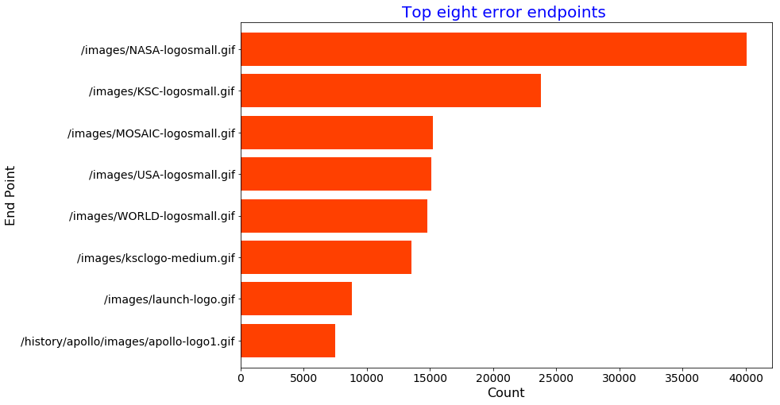


**DataFrame way**


```python
(parsed_df.filter(parsed_df['status_code']!=200)
 .groupBy('endpoint').count().orderBy('count', ascending = False)
   .show(8, truncate = False))
```

    +---------------------------------------+-----+
    |endpoint                               |count|
    +---------------------------------------+-----+
    |/images/NASA-logosmall.gif             |40090|
    |/images/KSC-logosmall.gif              |23763|
    |/images/MOSAIC-logosmall.gif           |15245|
    |/images/USA-logosmall.gif              |15142|
    |/images/WORLD-logosmall.gif            |14773|
    |/images/ksclogo-medium.gif             |13559|
    |/images/launch-logo.gif                |8806 |
    |/history/apollo/images/apollo-logo1.gif|7489 |
    +---------------------------------------+-----+
    only showing top 8 rows
    


**SQL way**


```python
sqlcontext.sql("SELECT endpoint, count(*) AS count FROM parsed_table \
WHERE status_code != 200 GROUP BY endpoint ORDER BY count DESC LIMIT 8").show(truncate = False)
```

    +---------------------------------------+-----+
    |endpoint                               |count|
    +---------------------------------------+-----+
    |/images/NASA-logosmall.gif             |40090|
    |/images/KSC-logosmall.gif              |23763|
    |/images/MOSAIC-logosmall.gif           |15245|
    |/images/USA-logosmall.gif              |15142|
    |/images/WORLD-logosmall.gif            |14773|
    |/images/ksclogo-medium.gif             |13559|
    |/images/launch-logo.gif                |8806 |
    |/history/apollo/images/apollo-logo1.gif|7489 |
    +---------------------------------------+-----+
    


#### 6. How many unique hosts are there in the entire log?

**RDD way**


```python
parsed_rdd2.map(lambda line: line[0]).distinct().count()
```


    137978


**DataFrame way**


```python
parsed_df.select(parsed_df['host']).distinct().count()
```


    137978


**SQL way**


```python
sqlcontext.sql("SELECT  count(distinct(host)) AS unique_host_count FROM parsed_table ").show(truncate = False)
```

    +-----------------+
    |unique_host_count|
    +-----------------+
    |137978           |
    +-----------------+
    


#### 7. Get the number of daily hosts.

**RDD way**


```python
from datetime import datetime
def day_month(line):
    date_time = line[3]
    return datetime.strptime(date_time[:11], "%d/%b/%Y")
```


```python
result = parsed_rdd2.map(lambda line:  (day_month(line), 1)).reduceByKey(lambda a, b: a + b).collect()
```


```python
day = [x[0] for x in result]
count = [x[1] for x in result]
day_count_dct = {'day':day, 'count':count}
day_count_df = pd.DataFrame(day_count_dct )

myplot = day_count_df.plot(figsize = (12,8), kind = "line", color = "#cc9900",
                               x = "day", y = "count", legend = False)


plt.ylabel("Count", fontsize = 16)
plt.xlabel("")
plt.title("Number of hosts per day ", fontsize = 20, color = 'b')
plt.xticks(size = 14)
plt.yticks(size = 14)
plt.show()
```


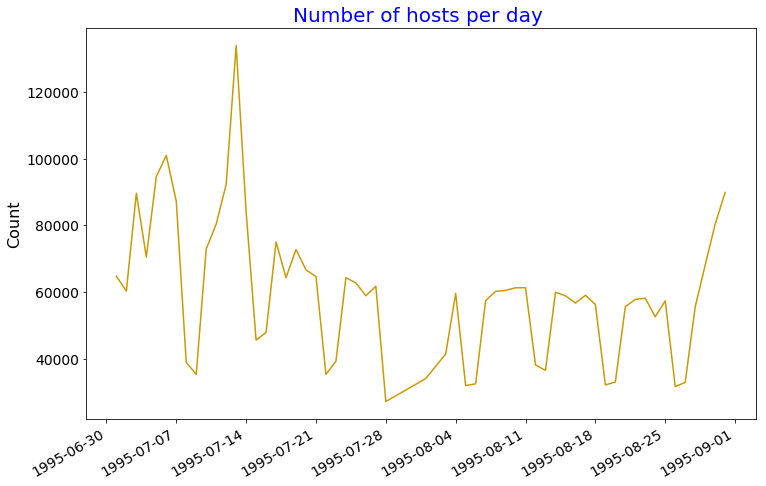


Now, let's just display the first ten values to compare  with results from the other methods.


```python
parsed_rdd2.map(lambda line:  (day_month(line), 1)).reduceByKey(lambda a, b: a + b).takeOrdered(10, lambda x: x[0])
```


    [(datetime.datetime(1995, 7, 1, 0, 0), 64714),
     (datetime.datetime(1995, 7, 2, 0, 0), 60265),
     (datetime.datetime(1995, 7, 3, 0, 0), 89584),
     (datetime.datetime(1995, 7, 4, 0, 0), 70452),
     (datetime.datetime(1995, 7, 5, 0, 0), 94575),
     (datetime.datetime(1995, 7, 6, 0, 0), 100960),
     (datetime.datetime(1995, 7, 7, 0, 0), 87233),
     (datetime.datetime(1995, 7, 8, 0, 0), 38866),
     (datetime.datetime(1995, 7, 9, 0, 0), 35272),
     (datetime.datetime(1995, 7, 10, 0, 0), 72860)]


**DataFrame way**


```python
from datetime import datetime
from pyspark.sql.functions import col,udf
from pyspark.sql.types import TimestampType

myfunc =  udf(lambda x: datetime.strptime(x, '%d/%b/%Y:%H:%M:%S'), TimestampType())
parsed_df2 = parsed_df.withColumn('date_time', myfunc(col('date_time')))
```


```python
from pyspark.sql.functions import date_format, month,dayofmonth

parsed_df2 = parsed_df2.withColumn("month", month(col("date_time"))).\
                                   withColumn("DayOfmonth", dayofmonth(col("date_time")))
    
n_hosts_by_day  = parsed_df2.groupBy(["month", "DayOfmonth"]).count().orderBy((["month", "DayOfmonth"]))
n_hosts_by_day.show(n = 10)
```

    +-----+----------+------+
    |month|DayOfmonth| count|
    +-----+----------+------+
    |    7|         1| 64714|
    |    7|         2| 60265|
    |    7|         3| 89584|
    |    7|         4| 70452|
    |    7|         5| 94575|
    |    7|         6|100960|
    |    7|         7| 87233|
    |    7|         8| 38866|
    |    7|         9| 35272|
    |    7|        10| 72860|
    +-----+----------+------+
    only showing top 10 rows
    


**SQL way**


```python
parsed_df2.createOrReplaceTempView("parsed_df2_table")
sqlcontext.sql("SELECT month, DayOfmonth, count(*) As count FROM parsed_df2_table GROUP BY month, DayOfmonth\
                 ORDER BY  month, DayOfmonth LIMIT 10").show()
```

    +-----+----------+------+
    |month|DayOfmonth| count|
    +-----+----------+------+
    |    7|         1| 64714|
    |    7|         2| 60265|
    |    7|         3| 89584|
    |    7|         4| 70452|
    |    7|         5| 94575|
    |    7|         6|100960|
    |    7|         7| 87233|
    |    7|         8| 38866|
    |    7|         9| 35272|
    |    7|        10| 72860|
    +-----+----------+------+
    


#### 8. Number of unique hosts per day

**RDD way**


```python
result = (parsed_rdd2.map(lambda line:  (day_month(line),line[0]))
          .groupByKey().mapValues(set)
          .map(lambda x: (x[0], len(x[1])))).collect()
```


```python
day = [x[0] for x in result]
count = [x[1] for x in result]
day_count_dct = {'day':day, 'count':count}
day_count_df = pd.DataFrame(day_count_dct )

myplot = day_count_df.plot(figsize = (12,8), kind = "line", color = "#000099",
                               x = "day", y = "count", legend = False)


plt.ylabel("Count", fontsize = 16)
plt.xlabel("")
plt.title("Number of unique hosts per day ", fontsize = 20, color = 'b')
plt.xticks(size = 14)
plt.yticks(size = 14)
plt.show()
```


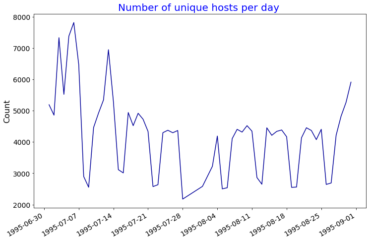


Now, let's display 10 days with the highest values to compare  with results from the other methods


```python
(parsed_rdd2.map(lambda line:  (day_month(line),line[0]))
          .groupByKey().mapValues(set)
          .map(lambda x: (x[0], len(x[1])))).takeOrdered(10, lambda x: x[0])
```


    [(datetime.datetime(1995, 7, 1, 0, 0), 5192),
     (datetime.datetime(1995, 7, 2, 0, 0), 4859),
     (datetime.datetime(1995, 7, 3, 0, 0), 7336),
     (datetime.datetime(1995, 7, 4, 0, 0), 5524),
     (datetime.datetime(1995, 7, 5, 0, 0), 7383),
     (datetime.datetime(1995, 7, 6, 0, 0), 7820),
     (datetime.datetime(1995, 7, 7, 0, 0), 6474),
     (datetime.datetime(1995, 7, 8, 0, 0), 2898),
     (datetime.datetime(1995, 7, 9, 0, 0), 2554),
     (datetime.datetime(1995, 7, 10, 0, 0), 4464)]


**SQL way**


```python
sqlcontext.sql("SELECT  DATE(date_time) Date, COUNT(DISTINCT host) AS totalUniqueHosts FROM\
                parsed_df2_table GROUP   BY  DATE(date_time) ORDER BY DATE(date_time) ASC").show(n = 10) 
```

    +----------+----------------+
    |      Date|totalUniqueHosts|
    +----------+----------------+
    |1995-07-01|            5192|
    |1995-07-02|            4859|
    |1995-07-03|            7336|
    |1995-07-04|            5524|
    |1995-07-05|            7383|
    |1995-07-06|            7820|
    |1995-07-07|            6474|
    |1995-07-08|            2898|
    |1995-07-09|            2554|
    |1995-07-10|            4464|
    +----------+----------------+
    only showing top 10 rows
    


#### 9. Average Number of Daily Requests per Hosts

**RDD way**


```python
unique_result = (parsed_rdd2.map(lambda line:  (day_month(line),line[0]))
          .groupByKey().mapValues(set)
          .map(lambda x: (x[0], len(x[1]))))

length_result = (parsed_rdd2.map(lambda line:  (day_month(line),line[0]))
          .groupByKey().mapValues(len))

joined = length_result.join(unique_result).map(lambda a: (a[0], (a[1][0])/(a[1][1]))).collect()
```


```python
day = [x[0] for x in joined]
count = [x[1] for x in joined]
day_count_dct = {'day':day, 'count':count}
day_count_df = pd.DataFrame(day_count_dct )

myplot = day_count_df.plot(figsize = (12,8), kind = "line", color = "#000099",
                               x = "day", y = "count", legend = False)


plt.ylabel("Count", fontsize = 16)
plt.xlabel("")
plt.title("Average number of daily requests per host", fontsize = 20, color = 'b')
plt.xticks(size = 14)
plt.yticks(size = 14)
plt.show()
```


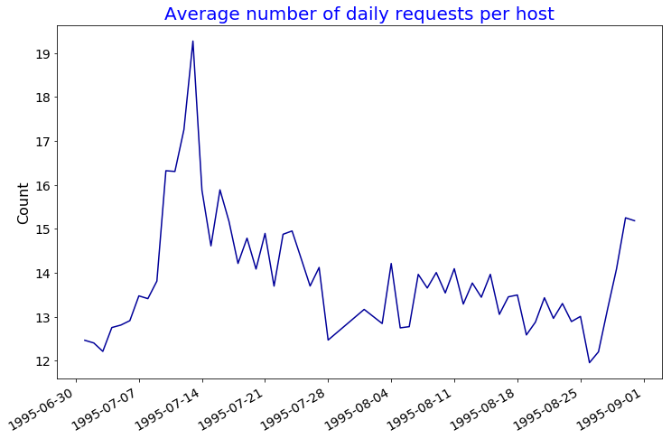


```python
sorted(joined)[:10]
```


    [(datetime.datetime(1995, 7, 1, 0, 0), 12.464175654853621),
     (datetime.datetime(1995, 7, 2, 0, 0), 12.40275776908829),
     (datetime.datetime(1995, 7, 3, 0, 0), 12.211559432933479),
     (datetime.datetime(1995, 7, 4, 0, 0), 12.753801593048516),
     (datetime.datetime(1995, 7, 5, 0, 0), 12.809833401056482),
     (datetime.datetime(1995, 7, 6, 0, 0), 12.910485933503836),
     (datetime.datetime(1995, 7, 7, 0, 0), 13.474358974358974),
     (datetime.datetime(1995, 7, 8, 0, 0), 13.411318150448585),
     (datetime.datetime(1995, 7, 9, 0, 0), 13.810493343774471),
     (datetime.datetime(1995, 7, 10, 0, 0), 16.32168458781362)]


**SQL way**


```python
sqlcontext.sql("SELECT  DATE(date_time) Date, COUNT(host)/COUNT(DISTINCT host) AS daily_requests_per_host FROM\
                parsed_df2_table GROUP   BY  DATE(date_time) ORDER BY DATE(date_time) ASC").show(n = 10) 
```

    +----------+-----------------------+
    |      Date|daily_requests_per_host|
    +----------+-----------------------+
    |1995-07-01|     12.464175654853621|
    |1995-07-02|      12.40275776908829|
    |1995-07-03|     12.211559432933479|
    |1995-07-04|     12.753801593048516|
    |1995-07-05|     12.809833401056482|
    |1995-07-06|     12.910485933503836|
    |1995-07-07|     13.474358974358974|
    |1995-07-08|     13.411318150448585|
    |1995-07-09|     13.810493343774471|
    |1995-07-10|      16.32168458781362|
    +----------+-----------------------+
    only showing top 10 rows
    


#### 10. How many 404 records are in the log?

**RDD way**


```python
parsed_rdd2.filter(lambda line: line[9] == '404').count()
```


    20890


**DataFrame way**


```python
parsed_df2.filter(parsed_df2['status_code']=="404").count()
```


    20890


**SQL way**


```python
sqlcontext.sql("SELECT  COUNT(*) AS logs_404_count FROM\
                parsed_df2_table WHERE status_code ==404").show(n = 10) 
```

    +--------------+
    |logs_404_count|
    +--------------+
    |         20890|
    +--------------+
    


#### 11.  Find the top five 404 response code endpoints

**RDD way**


```python
result = (parsed_rdd2.filter(lambda line: line[9] == '404')
          .map(lambda line: (line[6], 1))
          .reduceByKey(lambda a, b: a+b)
          .takeOrdered(5, lambda x: -x[1]))
result
```


    [('/pub/winvn/readme.txt', 2004),
     ('/pub/winvn/release.txt', 1732),
     ('/shuttle/missions/STS-69/mission-STS-69.html', 683),
     ('/shuttle/missions/sts-68/ksc-upclose.gif', 428),
     ('/history/apollo/a-001/a-001-patch-small.gif', 384)]


```python
endpoint = [x[0] for x in result]
count = [x[1] for x in result]
endpoint_count_dct = {'endpoint':endpoint, 'count':count}
endpoint_count_df = pd.DataFrame(endpoint_count_dct )

myplot = endpoint_count_df .plot(figsize = (12,8), kind = "barh", color = "#cc9900", width = 0.8,
                               x = "endpoint", y = "count", legend = False)

myplot.invert_yaxis()

plt.xlabel("Count", fontsize = 16)
plt.ylabel("End Point", fontsize = 16)
plt.title("Top ten endpoints with 404 response codes ", fontsize = 20, color = 'r')
plt.xticks(size = 14)
plt.yticks(size = 14)
plt.show()
```


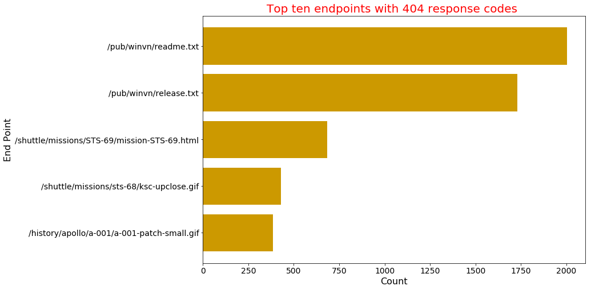


**DataFrame way**


```python
(parsed_df2.filter(parsed_df2['status_code']=="404")
.groupBy('endpoint').count().orderBy('count', ascending = False).show(5, truncate = False))
```

    +--------------------------------------------+-----+
    |endpoint                                    |count|
    +--------------------------------------------+-----+
    |/pub/winvn/readme.txt                       |2004 |
    |/pub/winvn/release.txt                      |1732 |
    |/shuttle/missions/STS-69/mission-STS-69.html|683  |
    |/shuttle/missions/sts-68/ksc-upclose.gif    |428  |
    |/history/apollo/a-001/a-001-patch-small.gif |384  |
    +--------------------------------------------+-----+
    only showing top 5 rows
    


**SQL way**


```python
sqlcontext.sql("SELECT endpoint, COUNT(*) AS count FROM\
                parsed_df2_table WHERE status_code ==404 GROUP BY endpoint\
                ORDER BY count DESC LIMIT 5").show(truncate = False) 
```

    +--------------------------------------------+-----+
    |endpoint                                    |count|
    +--------------------------------------------+-----+
    |/pub/winvn/readme.txt                       |2004 |
    |/pub/winvn/release.txt                      |1732 |
    |/shuttle/missions/STS-69/mission-STS-69.html|683  |
    |/shuttle/missions/sts-68/ksc-upclose.gif    |428  |
    |/history/apollo/a-001/a-001-patch-small.gif |384  |
    +--------------------------------------------+-----+
    


#### 12. Find the top five 404 response code hosts

**RDD way**


```python
result = (parsed_rdd2.filter(lambda line: line[9] == '404')
          .map(lambda line: (line[0], 1))
          .reduceByKey(lambda a, b: a+b)
          .takeOrdered(5, lambda x: -x[1]))
result
```


    [('hoohoo.ncsa.uiuc.edu', 251),
     ('piweba3y.prodigy.com', 157),
     ('jbiagioni.npt.nuwc.navy.mil', 132),
     ('piweba1y.prodigy.com', 114),
     ('www-d4.proxy.aol.com', 91)]


```python
host = [x[0] for x in result]
count = [x[1] for x in result]
host_count_dct = {'host':host, 'count':count}
host_count_df = pd.DataFrame(host_count_dct )

myplot = host_count_df .plot(figsize = (12,8), kind = "barh", color = "#cc9900", width = 0.8,
                               x = "host", y = "count", legend = False)

myplot.invert_yaxis()

plt.xlabel("Count", fontsize = 16)
plt.ylabel("Host", fontsize = 16)
plt.title("Top five hosts with 404 response codes ", fontsize = 20, color = 'r')
plt.xticks(size = 14)
plt.yticks(size = 14)
plt.show()
```


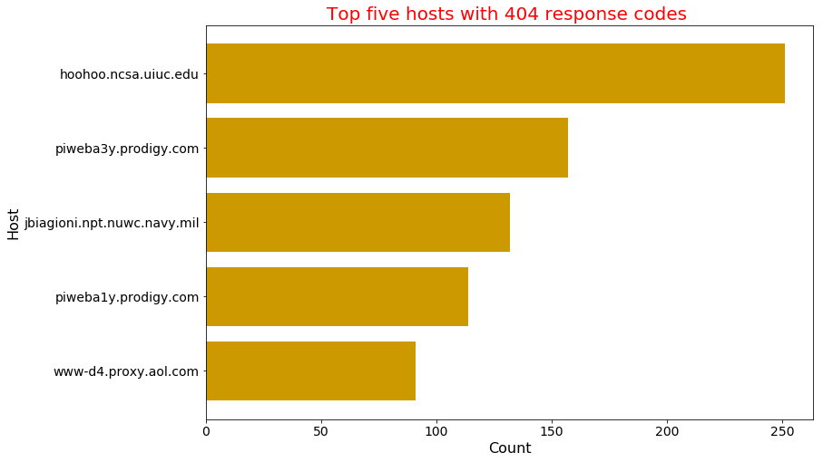


**DataFrame way**


```python
(parsed_df2.filter(parsed_df2['status_code']=="404")
.groupBy('host').count().orderBy('count', ascending = False).show(5, truncate = False))
```

    +---------------------------+-----+
    |host                       |count|
    +---------------------------+-----+
    |hoohoo.ncsa.uiuc.edu       |251  |
    |piweba3y.prodigy.com       |157  |
    |jbiagioni.npt.nuwc.navy.mil|132  |
    |piweba1y.prodigy.com       |114  |
    |www-d4.proxy.aol.com       |91   |
    +---------------------------+-----+
    only showing top 5 rows
    


**SQL way**


```python
sqlcontext.sql("SELECT host, COUNT(*) AS count FROM\
                parsed_df2_table WHERE status_code ==404 GROUP BY host\
                ORDER BY count DESC LIMIT 5").show(truncate = False) 
```

    +---------------------------+-----+
    |host                       |count|
    +---------------------------+-----+
    |hoohoo.ncsa.uiuc.edu       |251  |
    |piweba3y.prodigy.com       |157  |
    |jbiagioni.npt.nuwc.navy.mil|132  |
    |piweba1y.prodigy.com       |114  |
    |www-d4.proxy.aol.com       |91   |
    +---------------------------+-----+
    


#### 13. Create a viz of 404 response codes per day

**RDD way**


```python
result = (parsed_rdd2.filter(lambda line: line[9] == '404')
          .map(lambda line:  (day_month(line), 1))
          .reduceByKey(lambda a, b: a+b).collect())
```


```python
day = [x[0] for x in result]
count = [x[1] for x in result]
day_count_dct = {'day':day, 'count':count}
day_count_df = pd.DataFrame(day_count_dct )

myplot = day_count_df.plot(figsize = (12,8), kind = "line", color = "#cc9900",
                               x = "day", y = "count", legend = False)


plt.ylabel("Count", fontsize = 16)
plt.xlabel("")
plt.title("Number of 404 response codes per day ", fontsize = 20, color = 'r')
plt.xticks(size = 14)
plt.yticks(size = 14)
plt.show()
```


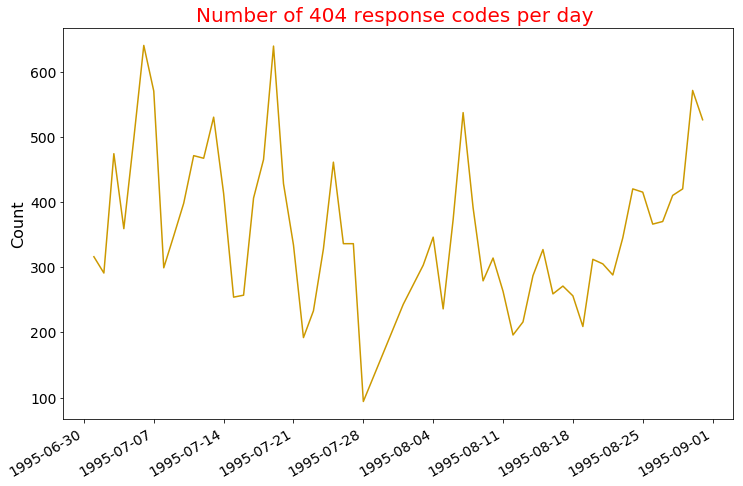


Now, let's display 10 days with the highest number of 404 errors to compare results from the other methods.


```python
day_count_df.sort_values('count', ascending = False)[:10]
```


<div>
<style scoped>
    .dataframe tbody tr th:only-of-type {
        vertical-align: middle;
    }

    .dataframe tbody tr th {
        vertical-align: top;
    }

    .dataframe thead th {
        text-align: right;
    }
</style>
<table border="1" class="dataframe">
  <thead>
    <tr style="text-align: right;">
      <th></th>
      <th>count</th>
      <th>day</th>
    </tr>
  </thead>
  <tbody>
    <tr>
      <th>25</th>
      <td>640</td>
      <td>1995-07-06</td>
    </tr>
    <tr>
      <th>30</th>
      <td>639</td>
      <td>1995-07-19</td>
    </tr>
    <tr>
      <th>15</th>
      <td>571</td>
      <td>1995-08-30</td>
    </tr>
    <tr>
      <th>34</th>
      <td>570</td>
      <td>1995-07-07</td>
    </tr>
    <tr>
      <th>50</th>
      <td>537</td>
      <td>1995-08-07</td>
    </tr>
    <tr>
      <th>17</th>
      <td>530</td>
      <td>1995-07-13</td>
    </tr>
    <tr>
      <th>6</th>
      <td>526</td>
      <td>1995-08-31</td>
    </tr>
    <tr>
      <th>4</th>
      <td>497</td>
      <td>1995-07-05</td>
    </tr>
    <tr>
      <th>27</th>
      <td>474</td>
      <td>1995-07-03</td>
    </tr>
    <tr>
      <th>56</th>
      <td>471</td>
      <td>1995-07-11</td>
    </tr>
  </tbody>
</table>
</div>


**DataFrame way**


```python
(parsed_df2.filter(parsed_df2['status_code']=="404")
.groupBy(["month", "DayOfmonth"]).count()
.orderBy('count', ascending = False).show(10)
)
```

    +-----+----------+-----+
    |month|DayOfmonth|count|
    +-----+----------+-----+
    |    7|         6|  640|
    |    7|        19|  639|
    |    8|        30|  571|
    |    7|         7|  570|
    |    8|         7|  537|
    |    7|        13|  530|
    |    8|        31|  526|
    |    7|         5|  497|
    |    7|         3|  474|
    |    7|        11|  471|
    +-----+----------+-----+
    only showing top 10 rows
    


**SQL way**


```python
sqlcontext.sql("SELECT  DATE(date_time) AS Date, COUNT(*) AS daily_404_erros FROM\
                parsed_df2_table WHERE status_code = 404 \
                GROUP   BY  DATE(date_time) ORDER BY daily_404_erros DESC LIMIT 10").show()
```

    +----------+---------------+
    |      Date|daily_404_erros|
    +----------+---------------+
    |1995-07-06|            640|
    |1995-07-19|            639|
    |1995-08-30|            571|
    |1995-07-07|            570|
    |1995-08-07|            537|
    |1995-07-13|            530|
    |1995-08-31|            526|
    |1995-07-05|            497|
    |1995-07-03|            474|
    |1995-07-11|            471|
    +----------+---------------+
    


#### 14. Top five days for 404 response codes 

**RDD way**


```python
(parsed_rdd2.filter(lambda line: line[9] == '404')
          .map(lambda line:  (day_month(line), 1))
          .reduceByKey(lambda a, b: a+b).takeOrdered(5, lambda x: -x[1]))
```


    [(datetime.datetime(1995, 7, 6, 0, 0), 640),
     (datetime.datetime(1995, 7, 19, 0, 0), 639),
     (datetime.datetime(1995, 8, 30, 0, 0), 571),
     (datetime.datetime(1995, 7, 7, 0, 0), 570),
     (datetime.datetime(1995, 8, 7, 0, 0), 537)]


This has been solved the SQL way and the RDD way in No. 13 above.

#### 15. Create an hourly 404 response codes line chart

**RDD way**


```python
def date_time(line):
    date_time = line[3]
    return datetime.strptime(date_time, "%d/%b/%Y:%H:%M:%S")
```


```python
result = (parsed_rdd2.filter(lambda line: line[9] == '404').map(lambda line:  (date_time(line).hour, 1))
          .reduceByKey(lambda a, b: a + b)).collect()
result = sorted(result)
```


```python
hour = [x[0] for x in result]
count = [x[1] for x in result]
hour_count_dct = {'hour': hour, 'count':count}
hour_count_df = pd.DataFrame(hour_count_dct )

myplot = hour_count_df.plot(figsize = (12,8), kind = "bar", color = "#000000",x ='hour',
                                y = "count", legend = False)


plt.ylabel("Count", fontsize = 16)
plt.xlabel("Hour of day", fontsize = 16)
plt.title("Number of 404 errors per hour ", fontsize = 20, color = 'r')
plt.xticks(size = 14)
plt.yticks(size = 14)
plt.show()
```


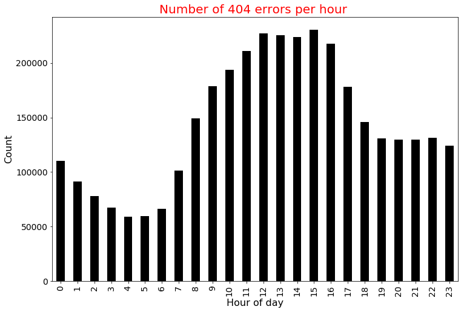


```python
result[:10] # Just displaying the first five to compare results from the other methods
```


    [(0, 774),
     (1, 648),
     (2, 868),
     (3, 603),
     (4, 351),
     (5, 306),
     (6, 269),
     (7, 458),
     (8, 705),
     (9, 840)]


**DataFrame way**


```python
from pyspark.sql.functions import hour
parsed_df3 = parsed_df2.withColumn('hour_of_day', hour(col('date_time')))

(parsed_df3.filter(parsed_df3['status_code']=="404")
.groupBy("hour_of_day").count()
.orderBy("hour_of_day", ascending = True).show(10))
```

    +-----------+-----+
    |hour_of_day|count|
    +-----------+-----+
    |          0|  774|
    |          1|  648|
    |          2|  868|
    |          3|  603|
    |          4|  351|
    |          5|  306|
    |          6|  269|
    |          7|  458|
    |          8|  705|
    |          9|  840|
    +-----------+-----+
    only showing top 10 rows
    


**SQL way**


```python
sqlcontext.sql("SELECT  HOUR(date_time) AS hour, COUNT(*) AS hourly_404_erros FROM\
                parsed_df2_table WHERE status_code = 404 \
                GROUP BY HOUR(date_time) ORDER BY HOUR(date_time) LIMIT 10").show(n = 100)
```

    +----+----------------+
    |hour|hourly_404_erros|
    +----+----------------+
    |   0|             774|
    |   1|             648|
    |   2|             868|
    |   3|             603|
    |   4|             351|
    |   5|             306|
    |   6|             269|
    |   7|             458|
    |   8|             705|
    |   9|             840|
    +----+----------------+
    


**This is enough for today. See you in the next part of the DataFrames Vs RDDs in Spark tutorial series.**
